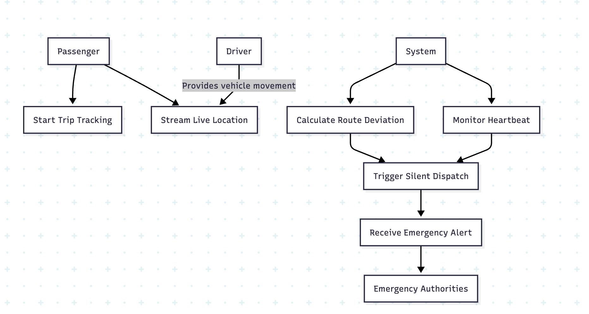

# Use Case Diagram

```mermaid
useCaseDiagram
    actor "Passenger" as P
    actor "Driver" as D
    actor "Emergency Authorities" as A
    actor "System" as S

    package "Ride-Share Safety System" {
        usecase "Start Trip Tracking" as UC1
        usecase "Stream Live Location" as UC2
        usecase "Calculate Route Deviation" as UC3
        usecase "Trigger Silent Dispatch" as UC4
        usecase "Monitor Heartbeat" as UC5
        usecase "Receive Emergency Alert" as UC6
    }

    P --> UC1
    P --> UC2
    S --> UC3
    S --> UC5
    UC3 --> UC4
    UC5 --> UC4
    UC4 --> UC6
    UC6 --> A
    D -- UC2 : (Provides vehicle movement)


    flowchart TD
    P["Passenger"]
    D["Driver"]
    A["Emergency Authorities"]
    S["System"]

    UC1["Start Trip Tracking"]
    UC2["Stream Live Location"]
    UC3["Calculate Route Deviation"]
    UC4["Trigger Silent Dispatch"]
    UC5["Monitor Heartbeat"]
    UC6["Receive Emergency Alert"]

    P --> UC1
    P --> UC2
    S --> UC3
    S --> UC5
    UC3 --> UC4
    UC5 --> UC4
    UC4 --> UC6
    UC6 --> A
    D -->|"Provides vehicle movement"| UC2
